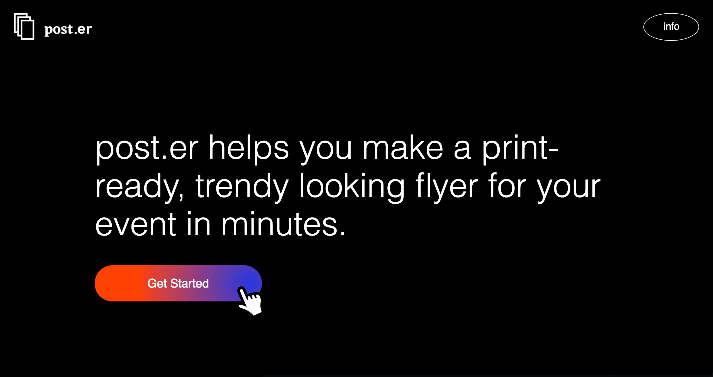

# Post–er

Post–er is a web app allows non-designers to create trendy flyers for their events in a few easy steps. Styles based on 2017 TRENDY GOOGLE FONTS COMBINATIONS by [Great Simple](http://fonts.greatsimple.io/).

[Live Demo](https://spexbakerx.github.io/post-er/)

## Table of Contents

  - [How it works](#how-it-works)
  - [Technologies used](#technologies-used)
  - [Browser compatibility](#browser-compatibility)
  - [Credits](#credits)

## How it works
Post–er takes user input and styles them using the Google Font API. Using html2canvas, the flyer preview is made into a canvas image, by reading the DOM and the different styles applied to the elements. When the user clicks 'Download' at the end of the app, the png is downloaded to the user's computer using Downloadjs. 

The final downloaded .png file size is equivalent to an a4 (11in x 17in) poster at 300dpi with .5in bleed.

## Technologies used ##

* HTML
* CSS
* Javascript
* jQuery
* Google Font API
* html2canvas
* npm
* download.js
* datedropper

## Browser compatibility ##

Html2canvas is highly experimental, so bugs are still being worked out. This app works best in:

* Firefox 3.5+
* Google Chrome

## Credits
- [2017 TRENDY GOOGLE FONTS COMBINATIONS](http://fonts.greatsimple.io/)
- [html2canvas](https://html2canvas.hertzen.com/)
- [downloadjs](http://danml.com/download.html)
- [animatedModal.js](http://joaopereirawd.github.io/animatedModal.js/)
- [SweetAlert](https://sweetalert.js.org/)
- [datedropper](http://felicegattuso.com/projects/datedropper/)
